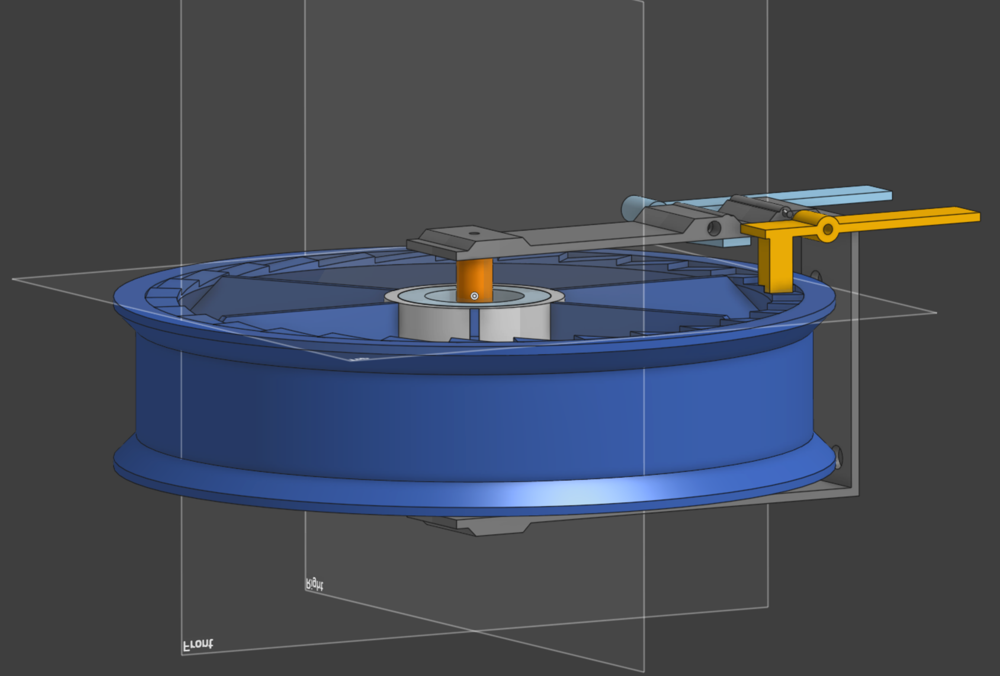

# Retractable Cable Spool

A 3D-printable retractable cable spool driven by a constant-force spring, with a
ratchet to hold the cable out and a brake to control speed while retracting.



## Source

All geometry lives in [`spool_flange.py`](spool_flange.py) — a single
[cadquery](https://cadquery.readthedocs.io/) script that generates every
printed part and the full assembly. The script was written collaboratively
with an LLM (Claude), which also handled the geometry math, the sourcing
research, and the assembly/printing documentation embedded in the module
docstring.

## Building

```bash
py -3.12 -m pip install cadquery
py -3.12 spool_flange.py
```

Running the script regenerates every STEP file in this directory:

- `spool_main_body.step` — spool with drum, flanges, ratchet teeth, brake ring
- `bearing_cap.step` — top bearing retainer
- `axle.step` — fixed center shaft with integrated spring stub
- `lever_housing.step` — U-bracket carrying both levers above the top flange
- `ratchet_lever.step`, `brake_lever.step` — the two actuating levers
- `brake_housing_pin.step` — small separately-printed stop pin (glues into the housing)
- `ratchet_spring.step`, `brake_spring.step` — visualization-only dummies of the purchased torsion springs
- `assembly.step` — everything in its as-built relative position, for dimensional verification

## Documentation

Everything you need to build one — purchased parts with SKUs and links,
sourcing plan, tuning constants, print orientation, and step-by-step
assembly — is in the module docstring at the top of
[`spool_flange.py`](spool_flange.py).
