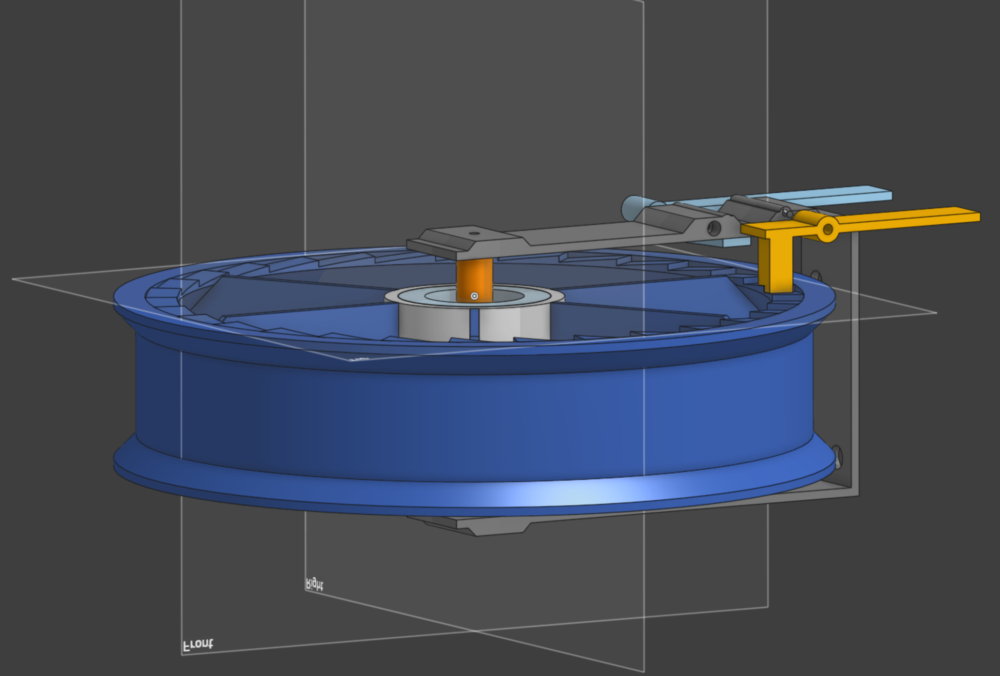

# Retractable Cable Spool

A 3D-printable retractable cable spool driven by a power spring (harvested
from a Stanley 30-455 tape-measure cassette), with a ratchet to hold the
cable out and a brake to control retraction speed. Routes a USB-A-to-C
source cable to the powered end through an integrated pancake spool on the
top bearing cap.



## Building

```bash
py -3.12 -m pip install cadquery
py -3.12 -m src.build                  # all parts + assembly
py -3.12 -m src.build --part axle      # build a single part (faster iteration)
py -3.12 -m src.build --list           # list available part names
```

(or run the convenience wrapper: `./build.sh`)

This produces every STEP file in the repo root. Geometry-regression check:

```bash
py -3.12 tools/check_geometry.py             # diff against committed baseline
py -3.12 tools/check_geometry.py --update-baseline   # bless current as new baseline
```

## Source layout

| File                   | Contents                                           |
|------------------------|----------------------------------------------------|
| `src/dimensions.py`    | Top-level dimensional / material / fit constants + module-load asserts |
| `src/helpers.py`       | Geometric helpers (`cyl`, `cone_solid`, flange / spoke / ratchet helpers, `make_keys`, `heal`) |
| `src/spool.py`         | Initial main spool body — drum, flanges, hub, cap pockets, pancake flange, spring slot |
| `src/caps.py`          | Bearing caps + pancake spool + cap-key joining (mutates `spool.main_body` to add the groove sides of the keys) |
| `src/axle.py`          | Main spool axle — shaft, spring-engagement bosses, bearing-retention hats, cross-pin holes |
| `src/housing.py`       | U-bracket housing skeleton — plates, columns, spine, mount holes, lever-pivot/cross-pin/stop-pin holes |
| `src/housing_guide.py` | Guide-bearing area of the housing — bearing pocket, press hole, anti-rotation recess, sleeve, +Y wrap, gussets. Exposes `apply_to_housing()` |
| `src/housing_pins.py`  | `brake_housing_pin` + `brake_housing_rest_pin` (separately printed, glue-installed into the housing) |
| `src/guide_axle.py`    | Standalone guide-bearing axle part                 |
| `src/levers.py`        | Ratchet + brake levers + pawl/pad helpers (mutates `spool.main_body` to apply ratchet teeth + drum cable hole, since these depend on lever geometry) |
| `src/viz.py`           | Assembly-only viz parts: dummy 608 bearings + dummy torsion springs |
| `src/build.py`         | Orchestrator: imports parts in dependency order, heals, exports STEPs, builds assembly STEP. CLI: `--part NAME` / `--list` |

## Outputs

- `spool_main_body.step` — full spool: both flanges, drum (with ratchet teeth + brake ring), spokes, hub, bearing pockets, spring cavity, cap seats
- `bearing_cap_top.step` — top bearing retainer + integrated source-cable pancake spool (cone funnel + tongue cylinder)
- `bearing_cap_bottom.step` — bottom bearing retainer
- `pancake_spool.step` — flat 88 mm flange that press-fits onto bearing_cap_top to close the source-cable groove
- `axle.step` — fixed center shaft with integrated spring-engagement bosses
- `housing.step` — U-bracket holding the spool and carrying both levers + the guide-bearing pocket above the top flange
- `ratchet_lever.step`, `brake_lever.step` — the two actuating levers
- `brake_housing_pin.step`, `brake_housing_rest_pin.step` — separately-printed stop pins (glue-install)
- `guide_axle.step` — short axle for the side-rolling guide bearing
- `ratchet_spring.step`, `brake_spring.step` — visualization-only dummies of the purchased torsion springs
- `assembly.step` — every printed part + the 3 dummy bearings + 2 dummy torsion springs in their as-built positions, for dimensional verification

## Purchased parts

### Lee Spring (leespring.com)

- **Power spring**: harvested from a Stanley 30-455 tape-measure cassette
  (or equivalent). The cassette wraps around the axle's spring-engagement
  bosses; the spring's bent outer tab seats in a slot in the hub wall.
  Drives spool retraction.
- **2× torsion springs** — one right-wound, one left-wound, for the lever
  return torque. Both are music-wire 0.51 mm, coil OD 4.5 mm, rod 3 mm,
  body length 4.5 mm (= LEVER_RIM_H), 4.25 turns, leg length 19.99 mm,
  17.96 N·mm at 86° deflection.
  - Ratchet pivot, **right-wound**: [Lee LTMR050E 01 M](https://www.leespring.com/product/torsion-spring-ltmr050e01m-music-wire)
  - Brake pivot, **left-wound**: [Lee LTML050E 01 M](https://www.leespring.com/product/torsion-spring-ltml050e01m-music-wire)

### McMaster-Carr (mcmaster.com)

- **3× 608 bearing** — 8 mm bore, 22 mm OD, 7 mm wide. Two in the spool
  (top + bottom), one in the lever housing as the side-rolling guide
  against the pancake-side flange. Any ZZ or RS version works.
- **4× [McMaster 94459A110](https://www.mcmaster.com/94459A110/)** — M2 × 0.4 heat-set brass inserts (Ø3.6 toothed,
  2.5 mm length, 3.3 mm pilot). Two for the lever pivots
  (ratchet at +y face x=76, brake at -y face x=55), two for the axle
  cross-pins (-y face at each plate's z, opposite the screw head).
- **4× [McMaster 91292A013](https://www.mcmaster.com/91292A013/)** — M2 × 20 mm cap screws. Two are the
  lever pivots: thread into the lever-side housing inserts and clamp
  each lever axially; the smooth shank under the head supports the
  spring coil. Two are the axle cross-pins: enter through the +y face
  counterbore, pass through the housing and the axle's cross-hole,
  thread into the -y face insert. Locks the axle against rotation
  and axial slide.
- **1× [McMaster 86495K36](https://www.mcmaster.com/86495K36/)** — Oil-resistant Buna-N rubber sheet,
  12″×24″, 3 mm thick, 70A durometer. Cut a ~7×13 mm pad (bounded by
  arcs at r=73, r=80) and bond to the underside of the brake-lever pad.
  Way more sheet than needed; one sheet supports many builds.
- **Super glue** — a few drops, to retain `brake_housing_pin` in its keyed hole.
- **1× [McMaster 90915A641](https://www.mcmaster.com/90915A641/)** — 10-24 wood-screw-to-stud, 1″ long.
  Wall-mount stud through the front spine's centered hole.
- **1× [McMaster 90389A112](https://www.mcmaster.com/90389A112/)** — 10-24 flange nut (12.7 mm flange OD,
  316 SS). Tighten on the +x face of the spine to clamp the housing
  against the mounting board.

## Print orientation

Material: **PA6-GF**. Supports: **ASA**, only where unavoidable.

The 45° sloped flanges and the spring boss's 45° underside chamfers keep
the spool self-supporting. The separately-printed `brake_housing_pin` and
45° cones on all blind-hole ends keep the housing supportless too. The
production axle prints vertically with the spring boss's 45° chamfers
self-supporting the +X overhangs.

## Assembly

1. **Press bottom bearing** into main body — seats against the 20 mm
   retention lip behind the pocket.
2. **Drop the axle** through the open top of the main body. Shaft threads
   through the bottom bearing; spring-boss section settles into the
   spring cavity.
3. **Install the power spring**. Stretch the cassette spring's coil over
   the spring-engagement bosses on the axle; bend the outer tab into a
   short radial tab and drop it into the hub-wall slot from above
   (the slot's coned roof clears the bent section).
4. **Slide bearing_cap_bottom** into the bottom of the main body cavity.
   Bottoms out on the 1 mm inset lip (slip fit — easily removable for
   service).
5. **Slide bearing_cap_top** into the top — same fit. Press the top
   bearing into the cap's pocket from the spring-cavity face.
6. **Press the second 608 bearing** into the bearing_cap_bottom pocket,
   from the spring-cavity face.
7. **Heat-set M2 inserts** into both ends of the axle (3.2 mm pilots,
   insert flush with the axle tip on each end).
8. **Heat-set M2 inserts** into the lever-pivot faces of the housing
   (3.2 mm pilots): -y face at x=76 (ratchet pivot), +y face at x=55
   (brake pivot).
9. **Install `brake_housing_pin`**: drop super glue in the keyed blind
   hole on the +y side of the brake pivot column. Orient the pin so
   its D-flat matches the hole's flat (this automatically points the
   pin's diametral through-hole radially outward, which is what the
   spring leg expects). Lightly tap the pin home.
10. **Install the housing** onto the assembled spool. The housing is a
    closed rectangle in xz with both plates 11 mm thick, so it no longer
    snap-fits — install procedure needs revisiting (e.g., remove a spine
    temporarily, or change to a printed two-piece housing). For now,
    align so the axle ends pass through both plates' round axle holes.
11. **Install both cross-pins**: thread an M2 × 20 mm cap screw through
    each plate's +y face (counterbored 2 mm), through the axle's cross-
    hole, into the heat-set insert at the -y face. Locks the axle
    against rotation and axial slide.
12. **For each lever** (ratchet, brake):
    1. Slip the torsion spring coil over the lever's pivot boss.
    2. Offer the lever up to its pivot, slipping one spring leg through
       the housing stop pin's diametral through-hole before the lever
       face meets the housing.
    3. Rotate the lever so the other spring leg threads through the
       lever stop pin's through-hole, pre-loading the spring.
    4. Thread an M2 × 20 mm cap screw through the lever's pivot hole into
       the housing-side insert; tighten snugly. The lever should rotate
       freely.
13. **Cut a ~7 × 13 mm pad** from the Buna-N sheet (86495K36) to the
    brake contact footprint (bounded by arcs at r=73 and r=80) and bond
    it to the underside of the brake lever's pad block with contact
    cement or thin CA glue.
14. **Source-cable installation**: thread the source cable through the
    cable-entry hole in the back spine, around the pancake spool's
    cone funnel (4–5 wraps fit in the radial groove), through the
    transit hole in the spool's pancake-side flange, down along the
    180° spoke face, and out the drum-wall slot to wrap the drum OD.

## Tuning

Constants live in `src/dimensions.py` (top-level shared) and in each
`src/<part>.py` (part-specific geometry that doesn't propagate). Most
fits are standardized at **0.15 mm per side** (cylinder/box clearances,
slip fits) with **0.2 mm per side** for keys/notches. See the audit
table in `src/dimensions.py`.
